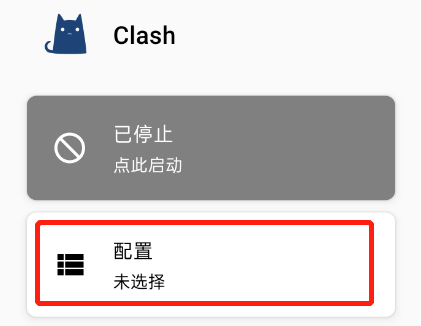
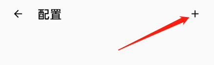
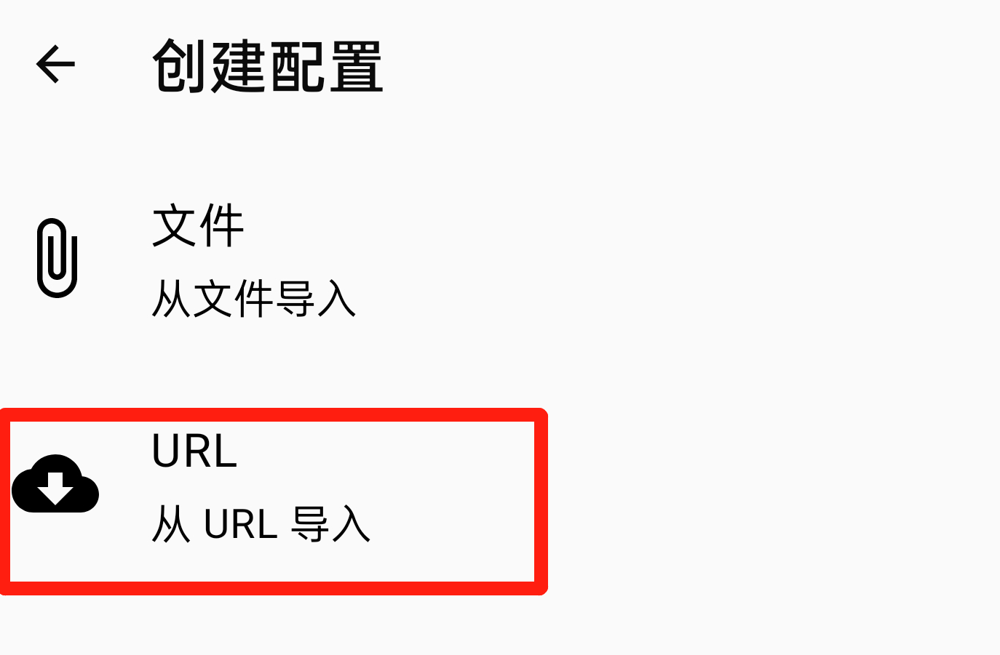
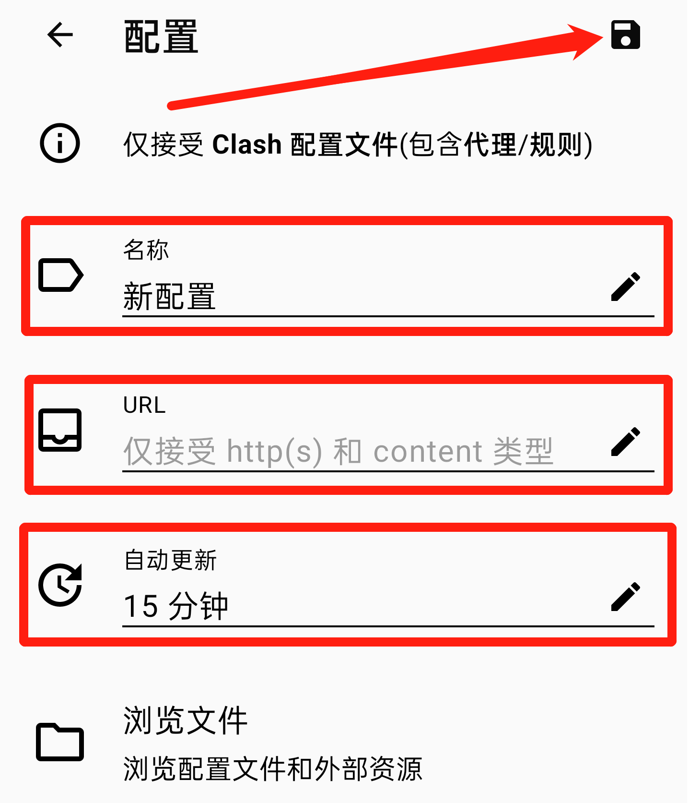
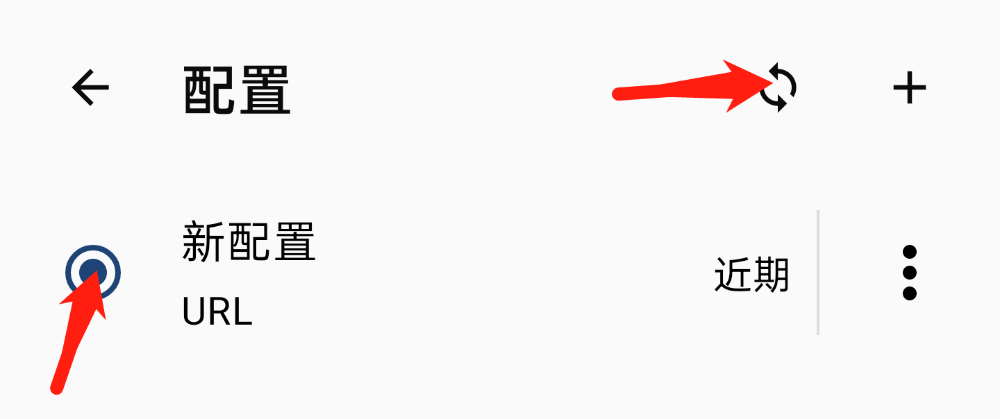
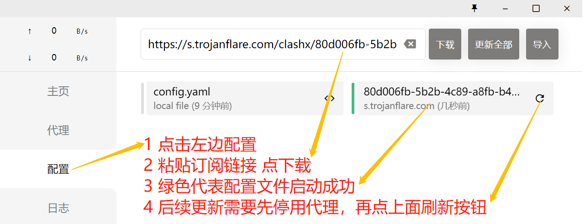
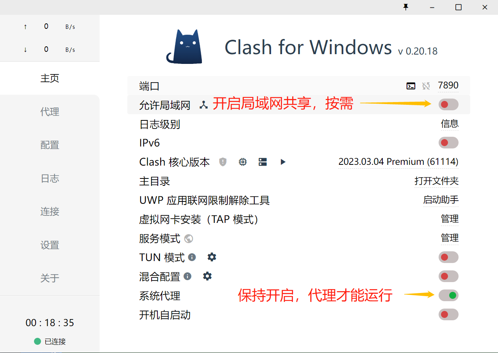
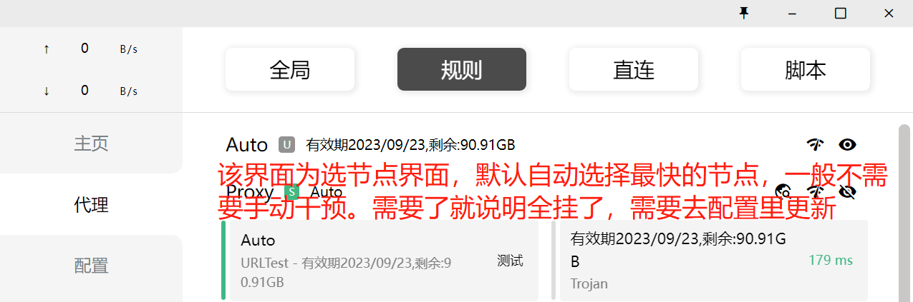
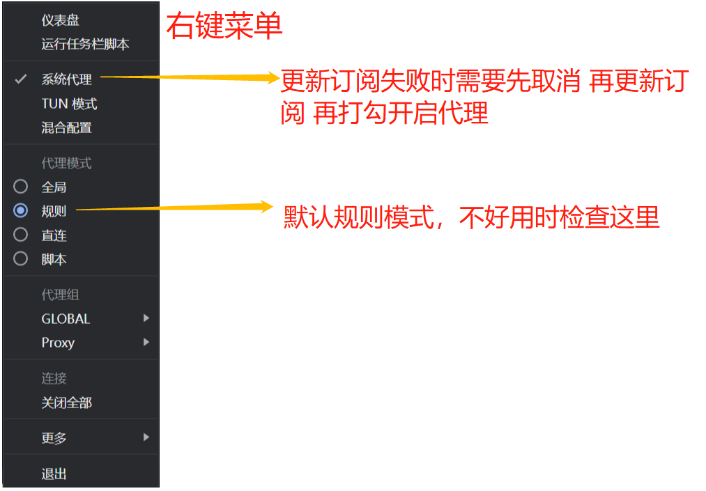

### 获取订阅链接
EEVPN

注册账号 - 购买 - 仪表盘 - 一键订阅 - 复制订阅地址

SHADOWSOCKS

注册账号 - 购买 - 产品服务 - 生效中的云加速服务 - CLASHX订阅 - 获得地址 - 复制地址

### IOS版shadowrocket使用教程

右上角+号，URL处粘贴订阅链接，右上角保存，开启代理即可

### 安卓版Clash使用教程

去网盘找到Clash.for.Android，双击下载并安装

名称随意

URL处粘贴订阅链接

右上角保存

不好用怎么办？

已开启代理的情况下，点代理，点右上角闪电符号测速，会自动选择可用服务器。

如果全挂，则先关闭代理关闭代理关闭代理，点配置，右上角刷新，然后再开启代理。
 
### 电脑版Clash使用教程

去网盘找到Clash.for.Windows，双击下载并解压

不好用怎么办？

已开启代理的情况下，点代理，点右上角WIFI符号测速。

如果不行，先关闭代理关闭代理关闭代理，点配置，右上角刷新，然后再开启代理。

