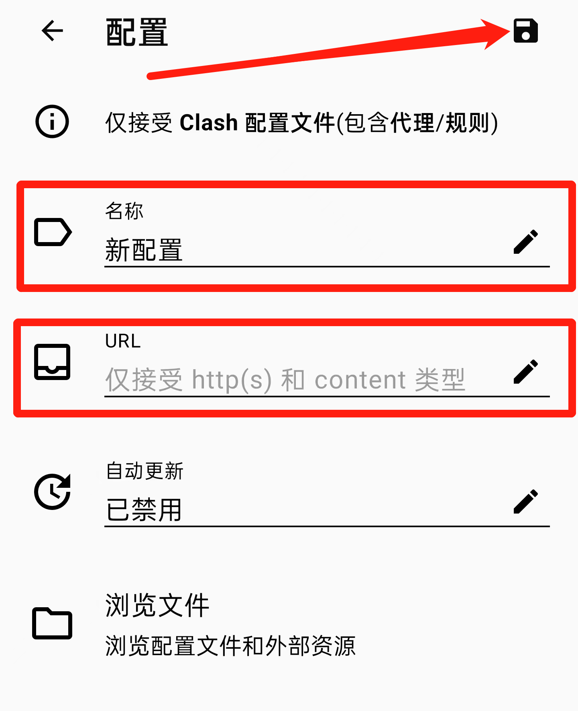

### 安卓版Clashw使用教程

去[这里](https://pan.caseu.ml/s/motE)找到Clash.for.Android，下载并安装

不好用怎么办？

已开启代理的情况下，点代理，点右上角闪电符号测速。

如果还不行，关闭代理，点配置，右上角刷新，然后再开启代理。
 
### 电脑版Clash使用教程

去[这里](https://pan.caseu.ml/s/motE)找到Clash.for.Windows，下载并解压

不好用怎么办？

已开启代理的情况下，点代理，点右上角WIFI符号测速。

如果还不行，关闭代理，点配置，右上角刷新，然后再开启代理。

